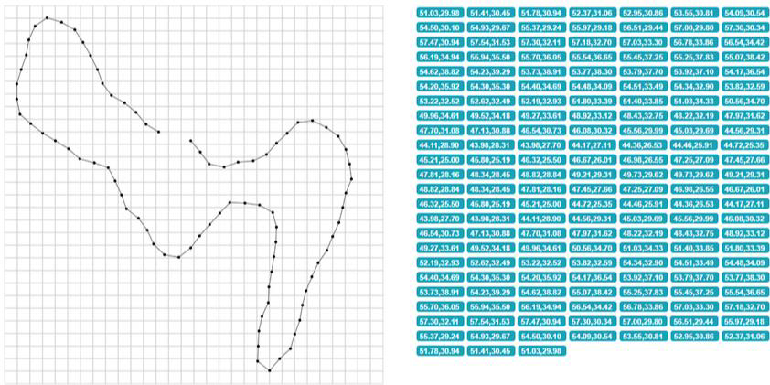

# Bot functionality

A bot's functionality is essentially what it can accomplish within a certain system or game. Whether it's 
handling in-game resources, acting quickly in-game, or simulating difficult decision-making, bots are made to 
automate particular tasks. Simple orders like auto-clicking or movement can be carried out by them, as well as 
more complex functions like handling whole in-game economies or responding to player behavior. The complexity of 
a bot's design dictates the extent of its capabilities, allowing it to perform jobs with a level of speed and 
accuracy that would be challenging for a human to match. The various functionality of bots that bot developers 
utilize will be the main topic of discussion in this section. 

Market Bots: Market bot is an umbrella name for 
bots which work with trading in-game items or resources for currency. These bots monitor and manipulate market 
prices, automatically buying low and selling high or undercutting prices of legitimate players. The downside to 
having this type of bots is that they ruin in-game economies by owning a particular share of a certain market. 
These bots can execute trades automatically, so they do not require any human input. They are faster than any 
human player at placing buy and sell orders, adjusting pricing, and completing deals or bids on an item (Sniper 
bots). Other disadvantages to players come in the form of flooding the market with a resource which causes 
devaluation of that item.

Spam Bots: Have you ever seen an open chat constantly spammed by a “Selling Gold” or “Selling boosts” 
advertisement, additionally with the site address and some of the costs of that service? (Figure 8) These are 
chat/spam bots. These bots will spam chat channels with advertisements or phishing attempts. A user will be 
required to go to a site to purchase in-game currency which is then delivered via in-game mail or trade to your 
character. For the person buying the in-game currency (Figure 7), this is an easy exchange of real-world money 
for “gold” or other in-game currencies, but this also comes at a risk of getting their account banned due to an 
unusual transaction and possible account theft or credit card fraud.

Figure 7: World of Warcraft Gold selling. Image taken from: https://overgear.com.
(WoW gold selling)[wow-gold.png]

Figure 8: Chat spam. Image available at: https://www.reddit.com.
(Client spam, reddit)[spam-reddit.png]

Grinding bots: The tasks that are automatically completed by grinding bots are usually labor-intensive and 
time-consuming, like gathering experience points (XP), engaging in combat, finishing quests, or carrying out 
other actions that advance a character's story. 

Farming bots: By enabling users to acquire materials or other 
valuable commodities, these bots might provide gamers with an unfair advantage in terms of resource 
accumulation. These bots frequently concentrate on repetitive tasks like mining, fishing, harvesting, or raiding 
particular regions. Item farming is added to this. Item farming bots are designed to acquire uncommon or 
valuable goods by continuously taking down bosses or enemies that are known to drop items and skins that may be 
sold later. A common way in which some farming bots work is by having a
predefined route, continuously going to the spawn point. The bot would control the character along a route and 
click on resources for collection (Figure 9).

Grinding and farming bots gained popularity among massively multiplayer online games. Early instances can be 
seen in titles such as Lineage II (2003), where bots were used to complete time-consuming in-game tasks to earn 
currency and other resources. The usage of these bots spread by the middle of the 2000s, which prompted game 
creators to implement anti-bot safeguards. Some examples are from Runescape (Runescape Bot Nuking Event Bans 1.5 
Million Bots in One Day | PC Gamer, n.d.), World of Warcraft (Blizzard Bans 30,000 from WoW - Talk / Random - 
KirupaForum, n.d.) and Aion (Aion: NCsoft Drops the Banhammer on 16,000 bot accounts — MMORPG.Com Forums, n.d.)

Figure 9: Predefined route example with X and Y coordinates.

PvP bots: A Player versus player (PvP) bot is designed to carry out tasks including moving, enemy selection, 
attacking by using a rotation of abilities, defending and utilizing character specific skills and items (pots 
and flasks). During battle, they frequently adhere to pre-established scripts that control their actions. 
Certain sophisticated PvP bots use machine learning or pattern recognition techniques to adjust to various 
opponents or situations, hence increasing their battle efficiency. 

Scripted behavior: Part of PvP bots is the scripted behavior of a bot. This feature allows bots to engage in 
more sophisticated maneuvers like staying out of enemy reach while using ranged attacks against an enemy (also 
known as kiting), dodging, or timing strong abilities for optimal effect, or they may stick to more 
straightforward routines like repeated use of fundamental attacks. 

Speedrun Bots: The term "speedrun bots" 
describes automated tools or bots used in the gameplay style known as "speedrunning," in which the goal is to 
finish a game or set of objectives as soon as possible. To reduce the time it takes to complete a speedrun, 
speedrunners frequently attempt to optimize their routes or manner in which a section of the game is played out. 
Bots can assist speedrunners in breaking down challenging game sections into recurring tasks. They can also be 
used to practice specific game sections, such as dodging opponent attacks or jumping over moving obstacles. A 
bot can practice something repeatedly until it picks up the proper timing. 

Since the early days of emulation, 
speedrun bots have existed, particularly Tool-Assisted Speedruns (TAS). TAS gained popularity with the advent of 
emulation software in the mid-2000s. It was during this period when tool-assisted speedruns were published by 
speedrun communities on websites such as Speed Demos Archive (Speed Demos Archive, n.d.) and later TASVideos 
(TASVideos, n.d.). But as speedrunning became more popular, particularly in the 2010s, the usage of bots for 
speedruns increased. 

Pixel bots: This bot type uses visual data, namely the color and placement of pixels on the 
screen. This bot would "recognize" the color changes on the screen and do specified actions depending on changes 
in the pixel patterns. Pixel bots use pixel recognition and pixel-based actions to function. Pixel recognition 
is the technique used by pixel bots to identify specific visual elements based on pixel patterns (such as the 
color of enemy units, health bars, resource color or clickable buttons). Pixel-based actions is the bot's 
pre-programmed actions, including clicking on enemies, moving to a specific place, or utilizing a skill, are 
triggered when it recognizes a specific pixel or collection of pixels. 

Aimbots: Designed to automatically aim at enemies in FPS games using two main methods: 
pixel detection and non-pixel detection. Pixel-based aimbots analyze the game screen for specific visual cues, 
such as the color or shape of enemies, 
using image recognition algorithms to align the player's crosshair with the target. 
Non-pixel-based aimbots operate through memory reading or game physics manipulation, 
allowing them to track enemy positions directly from game data.

Based on how they interact with the 
gaming setting and how complex their decision-making is, pixel bots can be either static or dynamic in design. 

Static bots are straightforward, prewritten scripts that only function under certain, predetermined 
circumstances. When it comes to pixel bots, a static pixel bot would search for a very particular pixel or group 
of pixels and operate in the same way each time it was found.

More sophisticated bots can adjust to shifting game circumstances using pattern recognition and computer vision. 
These are called dynamic bots. Based on more in-depth pixel analysis, dynamic pixel bots can make decisions in 
real time and modify their behavior accordingly. 

Pattern recognition: Finding patterns in the input data, like 
shapes, colors, or sequences is known as pattern recognition. This usually entails identifying recurring in-game 
components. some examples are decreasing or increasing health bars, detecting the presence of herb nodes or an 
ore deposit based on their distinct color and shape in the game. Another example is the appearance of a 
particular enemy type. This causes the bot to do an action such as moving the character to the enemy location, 
begin attacking, avoid damage, and defending against an enemy. 

Computer vision: A bot that can use computer 
vision may examine the pixels and shapes on the screen by real-time video input or by taking screenshots. After 
that, it decodes this visual information to understand the input and engage with the gaming environment. This 
can involve identifying character figures, terrain, backdrops, and other in-game visual components. 

A popular 
computer vision technique where the bot recognizes items or locations in the game by comparing a portion of the 
screen with a predetermined image is called template matching. 

In first-person shooter games, aimbots employ 
computer vision to identify hitboxes or character models to identify hostile players. Based on visual input, the 
bot then automatically targets and fires at an enemy. 

Bots which use computer vision and pattern recognition 
techniques without direct access to game memory or code can operate independently of specific game versions or 
updates, making them less detectable and more adaptable across different games or software environments. Because 
they don't add code to the game, they rely only on visual input, which makes it more difficult to detect by 
anti-cheat software. 

Dynamic bots originated in the mid-2000s ([Bot] Healbot AI, n.d. 2008), but gained traction 
in the 2010s with the advancement of AI and adaptive gameplay strategies in increasingly complex environments.

| Characteristic | Static Bots | Dynamic Bots |
| --- | --- | --- |
| Behavior | Unchanged repetitive actions | Adapts to changes in the game environment |
| Complexity | Pre-programmed instructions | Advanced decision-making and AI algorithms |
| Effectiveness | Limited to predictable tasks | Capable of handling complex, unpredictable tasks |
| Used for | Resource/item farming bots, Constant clicks on resources. |  AI-based bots, advanced PvP bots |
