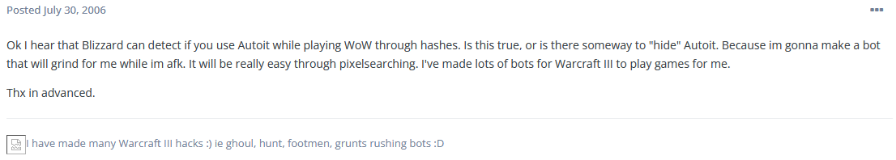
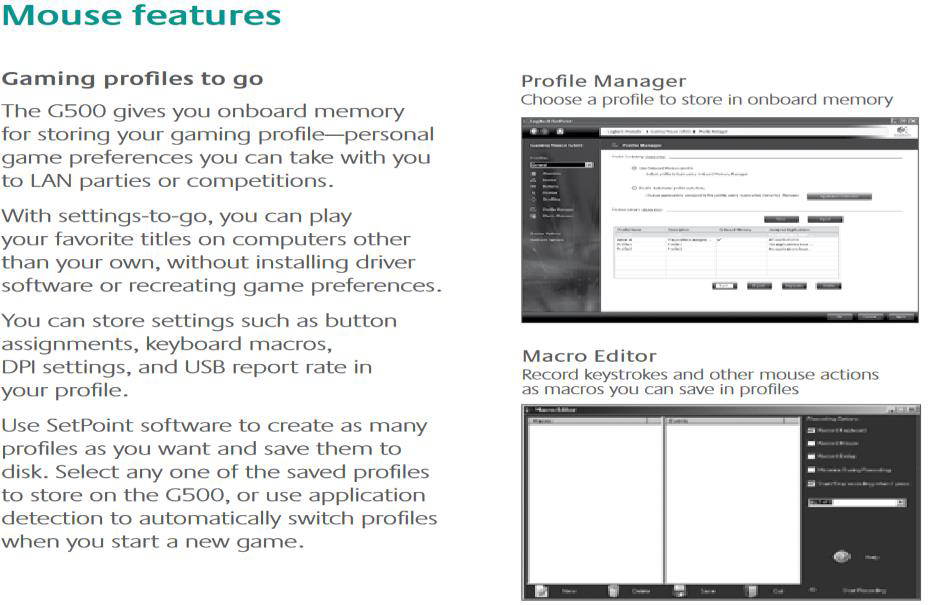
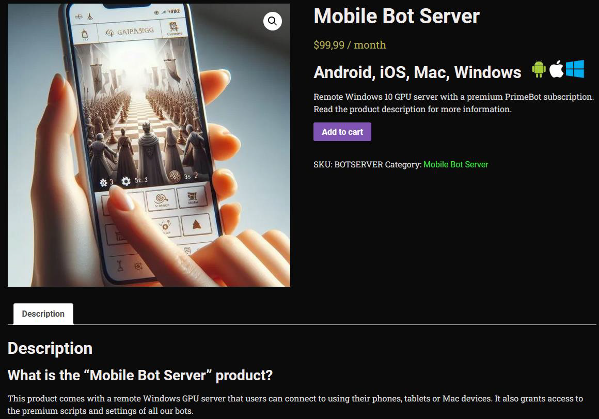
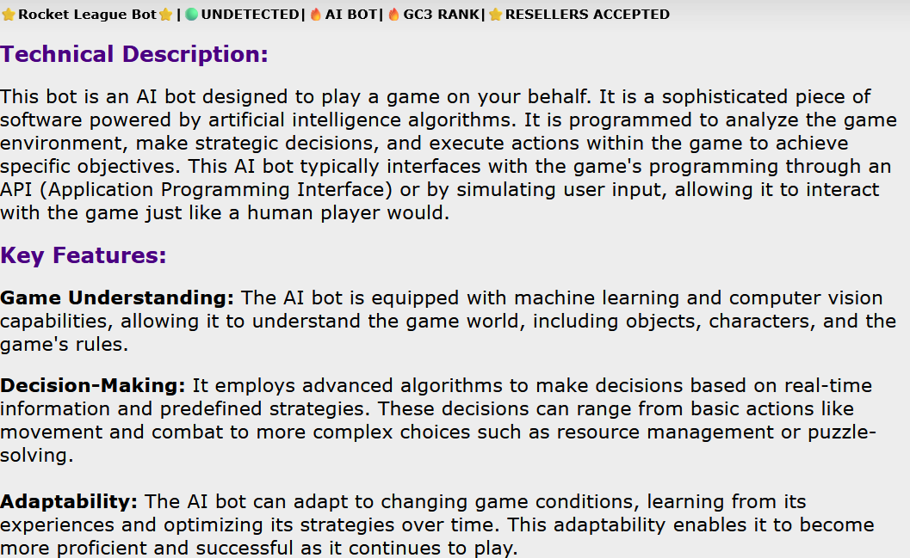
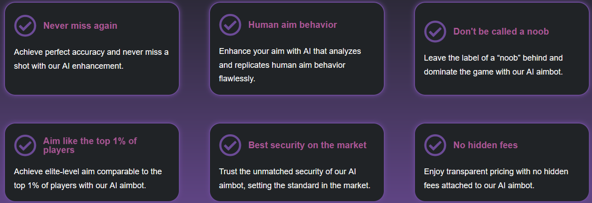

# The history of bots in games

## Brief history of botting

Using computer programs to automatically carry out in-game tasks is known as "botting", and it has a long and 
changing history in the world of video games, dating back to the early days of online multiplayer games. 
Automation through scripts and macros in text-based multiplayer online games, such as Multi-User Dungeons (MUDs) 
(Kang et al., 2016), gained popularity in the 1980s to 1990s. Automation tasks in Multi-User Dungeons come in 
the form of automapping. 

Text descriptions of rooms, exits, items, and directions are provided by MUDs. Parsing 
this text, automapping records the environment by finding the keywords used by MUDs. Automapping then utilizes 
this data to build an area representation. The user can then use automapping to retrace the recorded steps for 
easy resource and item finding. 

These early bots were intended to provide players with an advantage by enabling 
them to obtain resources or experience without actively participating. An example is a script which would 
automatically perform actions such as "search" or "gather" in specific areas to collect resources. 

Botting activity increased significantly as the gaming industry progressed into the late 1990s and early 2000s, with the 
emergence of Massively Multiplayer Online Role-Playing Games (MMORPGs) like World of Warcraft, and Ultima 
Online. These games' increasing popularity and complexity opened new possibilities for automation. 

More advanced bots could maneuver across challenging game situations like auto-attacking mobs, pathfinding, challenging other 
players through Player versus Player (PVP), questing, and resource farming. These bots were frequently used to 
farm in-game currency and items, which could subsequently be sold for actual money-more on that in the section 
[Motivations behind botting](motivations.md). This helped easily create a black-market economy that attracted players to sell 
both currency and items.

## The evolution of bot characteristics

### 1990s - Early 2000s
Initially, bots appeared in first-person shooter games and massively multiplayer online role-playing games 
(MMORPGs, such as 1999's EverQuest). Underground forums were used to exchange early botting scripts and tools. 
Players already made use of aimbots for early first-person shooter games like Quake and Counter-Strike. Aimbots 
in the past operated by using basic algorithms to lock onto the opponents.

### Mid 2000s
Discussions and botting tools for World of Warcraft were hosted on forums such as OwnedCore (known as MMOwned). 
Gamers built pixel-based bots using AutoIt and AutoHotkey to perform typical in-game activities. For example, 
when fishing in-game, a pixel bot would be used to sense the color shift of a fish bobber, the pixels would 
change and trigger an automatic click. Another MMORPG with a high bot usage rate was Lineage II (L2: Game 
Assistant (Cron 1) - Scripts and Functions - AutoHotkey Community, n.d.), especially for farming and grinding. 
Pixel detection was employed by these bots. Memory reading was also used during this period in bot development, 
to automate gameplay and was used for bots that farmed gold and XP (rather than merely pixel-based detection).
More on this in 2.3 Bot functionality. 

Figure 1: A post from AutoIt forums regarding AutoIt detection. 
Image taken from: https://www.autoitscript.com/forum/topic/30033-autoit-with-world-of-warcraft/.

### Late 2000s - Early 2010s

During this period, gaming became more competitive and provided the opportunity to make money while playing. 
This came by means of Esports, which became popular very quickly (When Did Esports Start and How It Changed 
Competitive Gaming, n.d.).

Esports, or “Electronic sports”, has been around since the 1950’s. In the case of 
online competitive gaming, Esports allowed players to compete against each other and win large amounts of money. 
Bots became a method to obtain unfair advantages as more players entered these games for competitive purposes, 
especially in player versus player scenarios. Scripts were utilized in hardware which were used by competitive gamers, 
these scripts were used the Logitech G series mouse, which included the Logitech G500, released in August 2009. 
This used Logitech Gaming Software, which allowed users to develop and assign macros for in-game activities. 
This software simplified the process of executing complex commands with a single button click. For instance, 
the user manual for the Logitech G500 explains how to utilize LGS to write custom commands to the mouse's programmable buttons 
(Figure 2) (User’s Guide Logitech ® Gaming Mouse G500, n.d.). 

How would this be used? If your weapon requires one button click for one shot of a weapon, 
then a script can make one button click create or as many shots or “clicks” as the user requires. This is a 
feature called “rapid fire” and increases the rate of fire of a weapon. There are other macros that reduce gun 
recoil or bullet spread.

Figure 2: Mouse features, Logitech user’s guide. Image taken from: https://www.logitech.com/

### 2010s - 2020

With the increasing complexity of 3D games, the 2010s saw significant advancements in computer vision and AI-driven pattern recognition, 
enabling bots to adapt to dynamic gameplay and complex environments. Real-time decision-making, pattern analysis, 
and opponent behavior prediction became possible with more sophisticated machine learning-based bots. While early game bots followed 
pre-set behaviors, modern AI-driven bots became more versatile, capable of learning from player actions and evolving strategies over time.

During this period, cloud emulators gained popularity as a component of the broader trend of cloud computing 
technology. With cloud emulators, users could run apps on virtualized cloud environments, especially games and 
apps for mobile devices. These emulators were especially helpful for developers, testers, and gamers since they 
allowed users to emulate various devices and operating systems without requiring powerful local hardware. 

In 2014, Genymotion became one of the first companies to provide cloud-hosted Android emulators, which made it 
possible to control mobile environments remotely. These cloud-based emulators were first designed for engineers, 
but bot developers began to use them as well. 

Cloud-based bots (Figure 3) became more and more common between 
2015 and 2017, particularly in mobile gaming. Freemium mobile games such as Clash of Clans and Pokemon Go became 
increasingly popular, and with them came the use of cloud-based Android emulators by bot developers to automate 
gaming, giving players an unfair advantage. 

During 2013, Cronus Zen (Figure 4) was made available, an external 
hardware device which gave players an advantage in gaming through enhanced control. With CronusMAX, users could 
remap buttons, connect various controllers to gaming consoles, and even apply unique scripts to lessen gun 
recoil and create modifications to improve aiming in first-person shooter (FPS) games like Call of Duty and 
Destiny. It was cross-platform, meaning it could be utilized on PC, Xbox, and PlayStation. 

Due to its use in competitive gaming situations, the device gained notoriety since it allowed players to take use of aim help 
without being noticed by in-game anti-cheat systems.

Figure 3: Primebot mobile bot cloud server. Image taken from: https://primebot.org/shop/mobile-bot-server/mobile-bot-server/.

Figure 4: Cronus Zen devices. Image taken from: https://cronus.shop/.

## 2020- Present

Bots that could learn from and adapt to player behavior were being created for competitive games, making it 
harder for even experienced players to win. Scripts which automate more sophisticated behaviors in games like 
League of Legends and Dota 2 had bot features such as seamless evading, identifying spells with great accuracy, 
and precise timing abilities. These scripts have developed to imitate human behaviors, making them harder to 
detect. During 2021-2023, many bot developers advertised machine learning and computer vision as standard 
capabilities of the bot being sold (Figure 5 and Figure 6). 

Bot-as-a-Service gained popularity in both the legal 
and illicit markets in the 2020s. Businesses found it easy to incorporate bots into their operations thanks to 
cloud platforms and automation technologies, but bad actors were increasingly using BaaS for gaming exploits and 
illicit activity. BaaS platforms for gaming have advanced further, providing scripts for macro automation and 
auto-aiming as well as cheating. Competitive online games like Call of Duty: Warzone and Apex Legends were still 
plagued by subscription-based cheating programs. 

Farms of Cloud Emulators. For game automation, some businesses 
put up whole farms of cloud-based emulators with bots running on them. These farms might be scaled up as needed 
and run with very little supervision.

Figure 5: Advertisement of Rocket league bot. Image taken from: https://www.elitepvpers.com/forum/rocket-league-trading/5172520-rocket-league-bot-undetected-artificial-intellignce-gc3-rank-gameplay.html.

Figure 6: Advertised features when buying an AI aimbot. Image taken from: https://aimsync.ai/.

