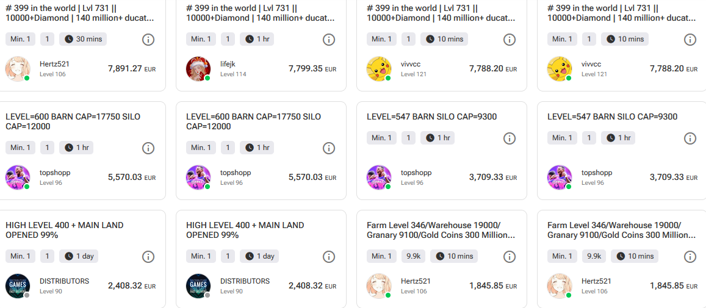
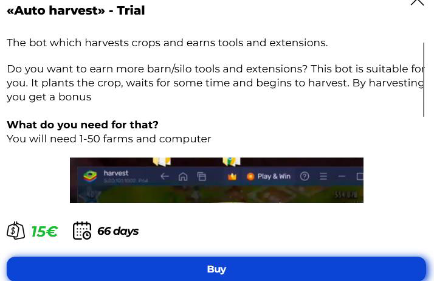
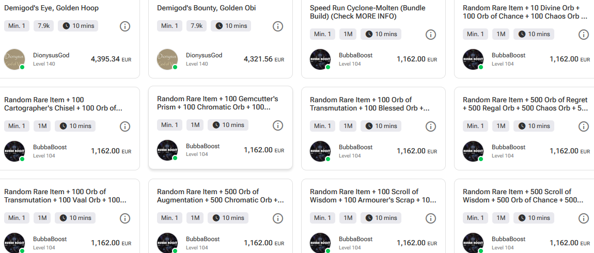

# Motivations behind botting

## Economic incentives

Bot creation in online games and services can be highly profitable for bot developers due to multiple revenue 
streams. Some of the methods used are selling bot subscriptions, selling farmed resources and currency through 
bot farms for real world money, selling leveled accounts using bots and lastly item farming.

### Bot subscriptions

Bot developers build programs that automate monotonous activities, resource harvesting, character leveling, and 
other tasks seen in online games. Players that would rather not like to spend time on these activities can 
purchase a bot subscription. Users must pay a monthly or annual subscription fee to the developers to access and 
utilize bot software.

### Account selling

Bot developers also use leveled accounts as a form of income. This is done by not only leveling accounts but 
collecting different forms of resources on the account in order to make it more attractive to buyers. The cost 
of a botted account is higher if content is already unlocked, the account is at a high level and there is an 
abundance of resources (Figure 12).

Figure 12: Hayday account selling. Image taken from: https://www.g2g.com/categories/hay-day-global-account?srsltid=AfmBOooGlrN8nzvuHJaDnOJ2BFRUzfAkJZtt25D9jXqLKuNx9uGMRw5l&sort=highest_price.

### Bot farms - Selling farmed resources and currency

Large-scale bot farms are frequently created by bot developers. In a bot farm, multiple bots can control many 
accounts simultaneously. These bots gather in-game resources like gold, items, or currency. An example is the 
bot in Figure 13, that accumulates farm supplies and resources for the game Hayday. These resources can be sold 
for actual money. In-game currency is another product that developers sell to gamers. This is gold farming: Once 
a player purchases gold, the seller will send them the amount they bought in the game, this can come in the form 
of multiple in-game mails of odd amounts and at different times over a few minutes which sum up to the total 
amount bought. The odd amount sending is to avoid detection of one large amount.

Figure 13: Haydaybots. Image taken from: http://www.haydaybots.com/.

Bot farms can come in many forms for both mobile and PC. Some of the most used forms are phone farms (Box Phone 
Farm Click Farm - Motherboard Box, n.d.), where many phones mirror the input of one device which has a bot. The 
setup of each game on each device is the same. When the bot swipes or collects resources on the main device, all 
devices mirror the movement and collect resources on their individual games. Those resources are then sent to 
accounts that will be sold or clients that have prepurchase resources. 

Another form is the use of mobile 
emulators on PC. A bot can be placed on one emulator and rotate between many accounts, botting on each account. 
Many emulators can be opened on a PC. It is common to have over 500 bot farms gathering resources in a single 
day. An example of a simple farm bot is Hayday Farming B🐣T, which uses Macrorify (https://www.kok-emm.com/) creator mode to create bots. 

Lastly, another common method is the use of cloud emulators. These 
emulators do the exact same job as a mobile emulator but with greater effect as the user has access to better 
resources such as more CPU and RAM, allowing the user to run more emulators at the same time. It is also not 
uncommon for cloud emulators to have their own bots for users to purchase.

### Account boosting

Players will sometimes want their semi-leveled accounts to have further progression but do not want to do it 
themselves or use botting software on their machine. Illicit services that are reputed through cheat forums 
called “boosting” can be used for this.

A player would “hire” a booster to play on their account. The booster will at times use a bot, with or without 
the knowledge of their client. This bot is used to level up the account. This service also has a middleman who 
handles the game account details (such as the login details), payment of the client and completion review of the 
boosting service from the booster. An upfront service fee for the middleman is required from the client. Account 
boosting services sometimes have account requirements like a certain account level for the booster to start 
with.

### Item selling

Additionally, rare or expensive in-game items like armor, skins and weapons can be farmed by bots. Players who 
don't want to spend the time obtaining these items in-game can then purchase them. Rare products are sold by bot 
developers to gamers directly for real money. These kinds of items are frequently in demand from casual players 
who wish to avoid grinding or from competitive players

Figure 14: Path of Exile item selling. Image taken from: https://www.g2g.com/categories/poe-items?sort=highest_price.

