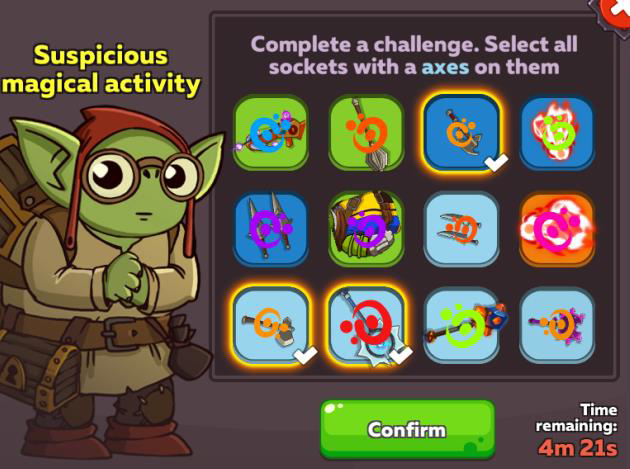

# Video game companies' response to botting

The growing usage of bots is a major problem for developers, who view botting as a threat to the integrity and fairness of their games. 
In response, developers have put in place a variety of anti-bot measures within their games.

**Client-side prevention**

Real-time prevention focuses on stopping bots before they interact with the game, usually by monitoring the local system. 
Let's have a look at random event prompts, anti-cheat, code obfuscation and keystroke inputs.

1.	Random event prompts    
One of the earliest forms of anti-bot techniques is random event prompts, which generate random tasks or events 
that require human participation, such as typing a certain sentence, figuring out a problem, or making an immediate decision within a given time.
Another form is CAPTCHA test. 
Runescape 2 is one game that uses this technique, while other platforms such as mobile games have random pop-ups that require the user to close the pop up to continue playing. 
These forms of bot detection, however, may disrupt the gameplay and frustrate legitimate players. Furthermore, unfortunately for game developers, 
these out-of-date techniques have already been circumvented by integrating third-party CAPTCHA solving services into bot programs, 
making it easier for game bots to bypass human verification on many gaming platforms.
Figure 10: In-game Captcha test. Image taken from: https://en.hustlepedia.fr/tips-portal/captcha/.

2.  Anti-cheat
Anti-cheat technology scans for known signatures of cheating software by monitoring the system for third-party tools or programs attempting to 
modify or read internal game data. The memory space of the game client is scanned, checking  for patterns, code injections or unauthorized modifications.

3.	Code obfuscation
This technique protects the game by encrypting its code or logic, making it harder for cheat and bot developers to reverse-engineer or modify the game. 
In the case of bot developers who rely on memory reading and not pixel-based detection, this method works well at times. 

4.	Keystroke analysis
Anti-cheat methods using memory scanning and signature detection will become ineffective when there is no memory manipulation, known cheating software signatures, 
or injection into the game, as they rely on interacting with the game's memory or detecting external software. 
In this instance, bot detection is more successful when keystroke analysis is used in conjunction with behavioral analysis to examine how a player interacts with 
the game via their keyboard and mouse, is more effective in detecting bots. Although bots heavily rely on keystroke patterns, they frequently attempt to imitate 
human input in order to evade detection. By analyzing the timing, frequency, and variation of keystrokes, automated scripts can be distinguished from human behavior.
 

**Server-side detection**

This relies on post-action detection, which uses server-side data logs and behavior analysis to detect suspicious activities based on server-side data logs and behavior analysis. 
The biggest challenge faced by gaming companies  is the lack of information that can effectively identify and differentiate between humans and bots. Let's discuss several common 
approaches to this kind of detection method.   

1.	Playing time detection
Bots are usually designed to run continually, carrying out monotonous jobs like character leveling, resource farming and grinding for in-game currency. 
In order to determine whether actions are being performed by real players or bots, unusual playtime detection systems will be used to measure the length of each player's uninterrupted play session.

2.	Behavior detections
This examines player behavior to find characteristics that would be seen as bot behavior. A lack of variation in movement or activity, unrealistic trade frequencies, 
perfect timing that is impossible for a human to execute, odd activity in trade histories, chat logs, transaction logs, loot patterns, or movements that repeat at precise intervals are a few examples.

3.	Rate limiting
Limiting the number of commands or actions a player may submit to the server in a certain amount of time helps prevent abuse and maintain server stability. 
This works effectively against bots that attempt to perform many activities in a second exceeding humanly possible rate.
